# Linux Security Hardening Lab (Ubuntu Server 22.04)

This project demonstrates foundational **Linux system hardening** techniques applied to an Ubuntu Server environment.  
The lab focuses on securing user access, SSH services, firewall rules, file permissions, and brute-force protection.

All configurations were performed in a **controlled lab environment** using Oracle VirtualBox.

---

## Objectives

- Secure a Linux server by following security best practices  
- Harden SSH access using key-based authentication  
- Restrict root access and enforce least privilege  
- Configure firewall rules using UFW  
- Apply proper file and directory permissions  
- Implement brute-force protection using Fail2Ban  

---

## Skills Demonstrated

- Linux system hardening  
- Secure SSH configuration  
- Firewall management (UFW)  
- Access control and permissions  
- Brute-force attack mitigation  
- Security best practices implementation  

---

## Lab Environment

- **Host OS:** Windows 11  
- **Hypervisor:** Oracle VirtualBox  
- **Guest OS:** Ubuntu Server 22.04 LTS  
- **Network Mode:** NAT  
- **Access Method:** SSH (key-based authentication)  

---

## Tools & Technologies Used

- OpenSSH  
- UFW (Uncomplicated Firewall)  
- Fail2Ban  
- Linux user and permission management  
- systemd services  

---

## Project Walkthrough

### 1. Virtual Machine Setup
Ubuntu Server 22.04 was installed on Oracle VirtualBox with NAT networking.

📸 Screenshots:

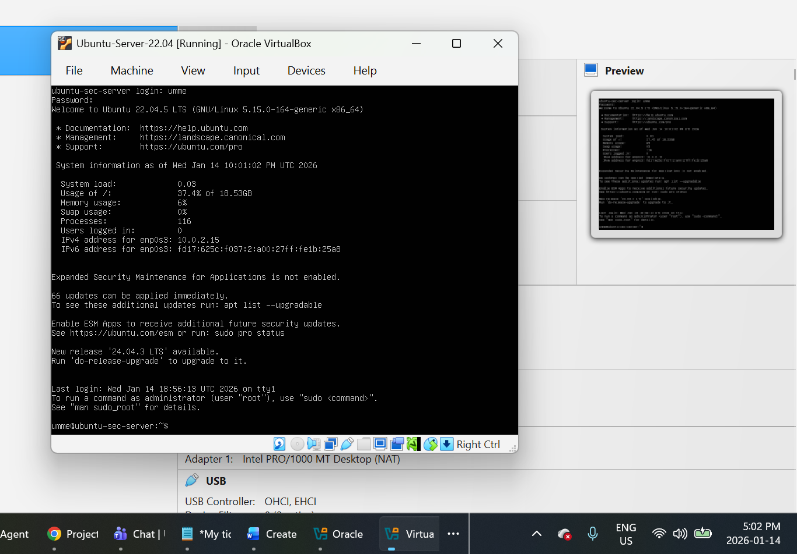

---

### 2. System Update
System packages were updated to ensure the latest security patches were applied.

📸 Screenshot:

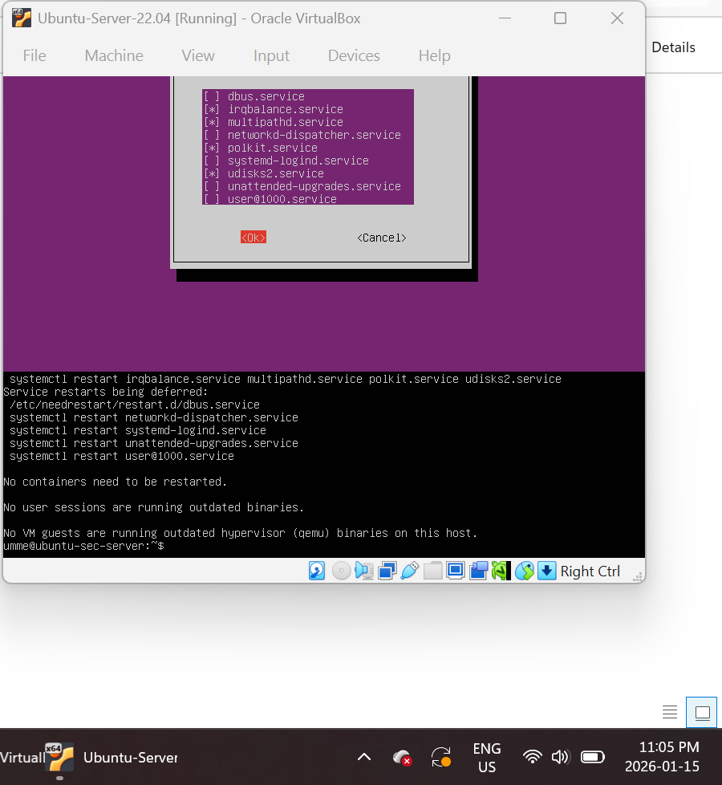

---

### 3. User Creation & Sudo Access
A non-root user (`analyst`) was created and granted sudo privileges, following the principle of least privilege.

📸 Screenshot:

---

### 4. Root Account Hardening
Direct root login was restricted to reduce the server’s attack surface.

📸 Screenshot:

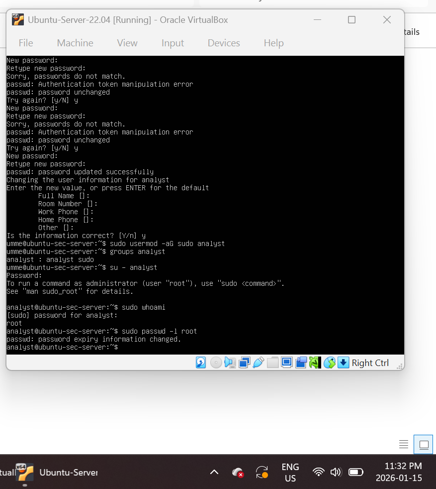

---

### 5. Firewall Configuration (UFW)
UFW was enabled and configured to allow SSH traffic only.

📸 Screenshot:

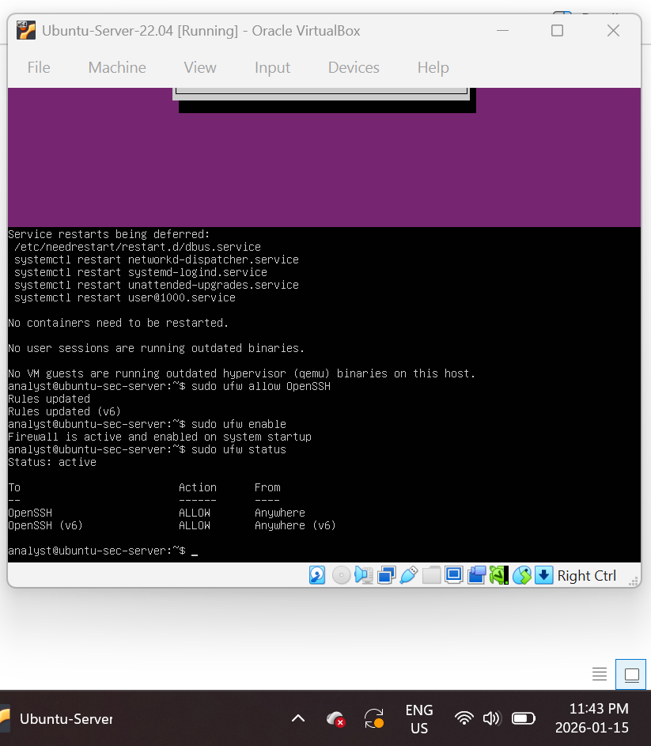

---

### 6. SSH Configuration Backup
The default SSH configuration file was backed up before applying hardening changes.

📸 Screenshot:

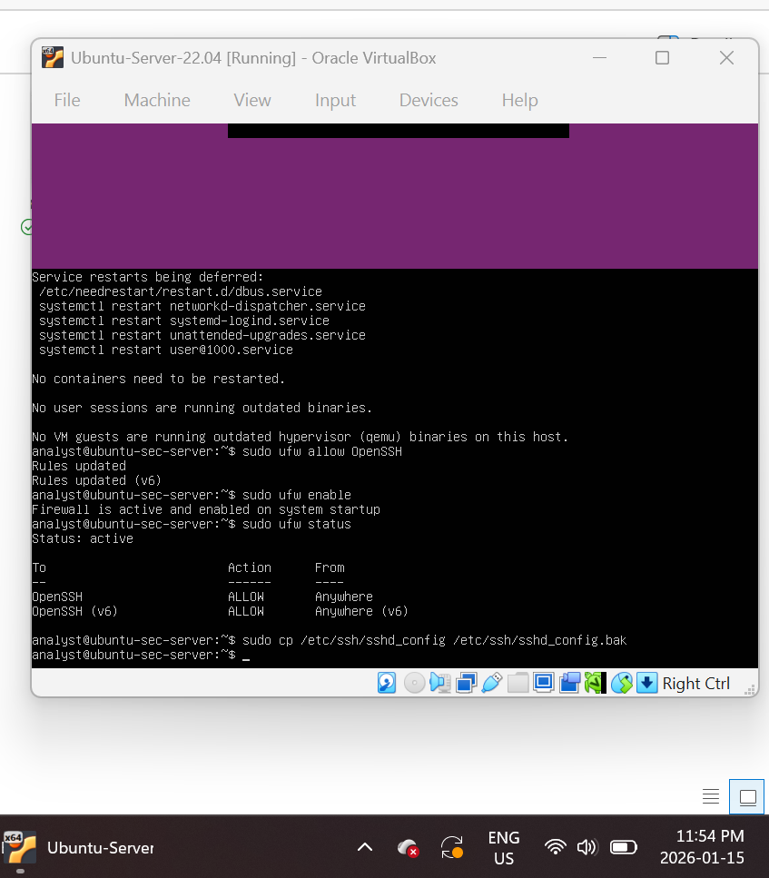

---

### 7. SSH Hardening
SSH was hardened with the following controls:
- Root login disabled  
- Password authentication disabled  
- Access restricted to a specific user  

📸 Screenshot:

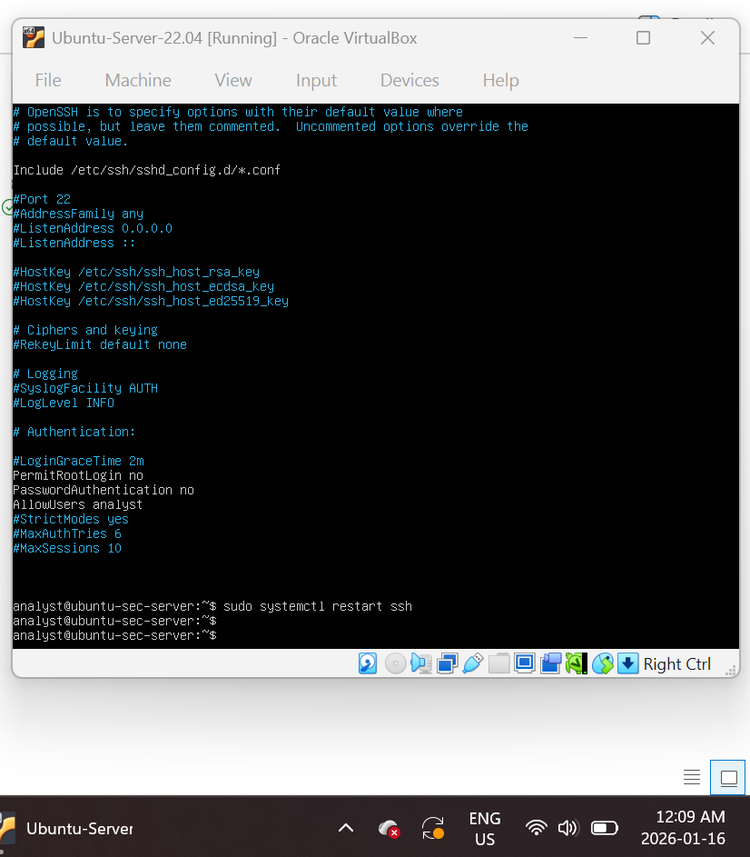

---

### 8. SSH Service Verification
The SSH service was restarted and verified to be running successfully.

📸 Screenshot:

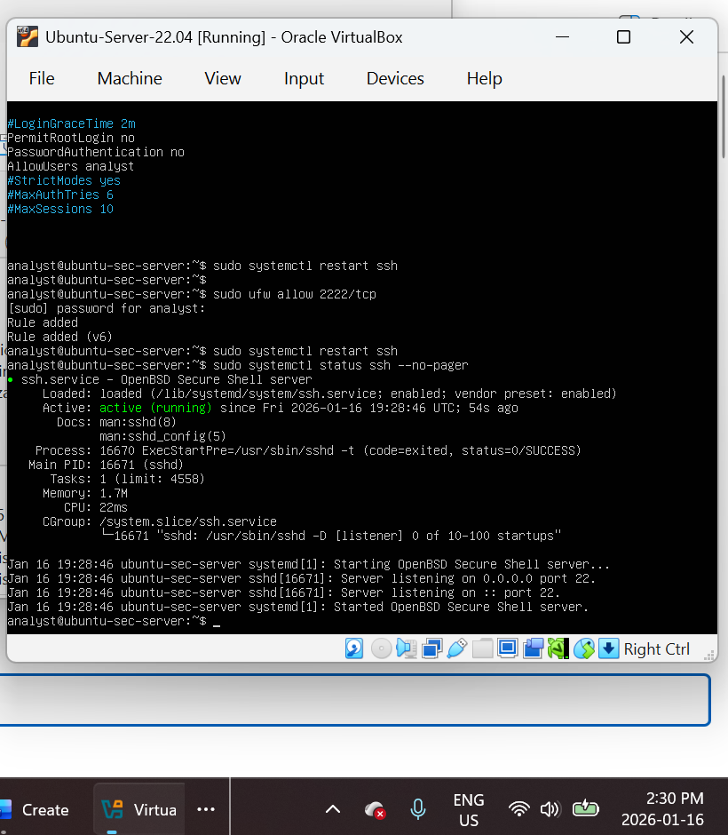

---

### 9. IP Address Identification
The server’s IP address was identified for SSH access.

📸 Screenshot:

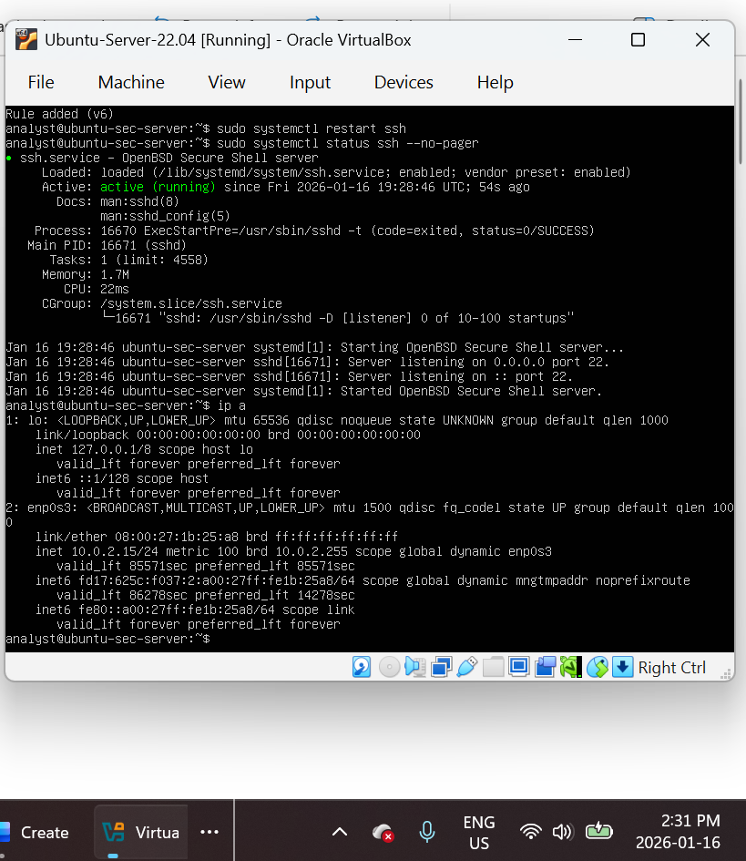

---

### 10. SSH Key Generation (Windows Client)
An SSH key pair was generated on the Windows host.

📸 Screenshot:

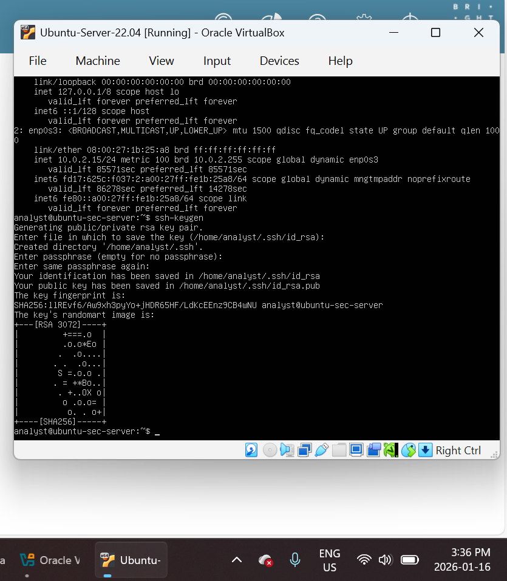

---

### 11. Public Key Deployment
The public SSH key was securely copied to the server’s `authorized_keys` file.

📸 Screenshot:

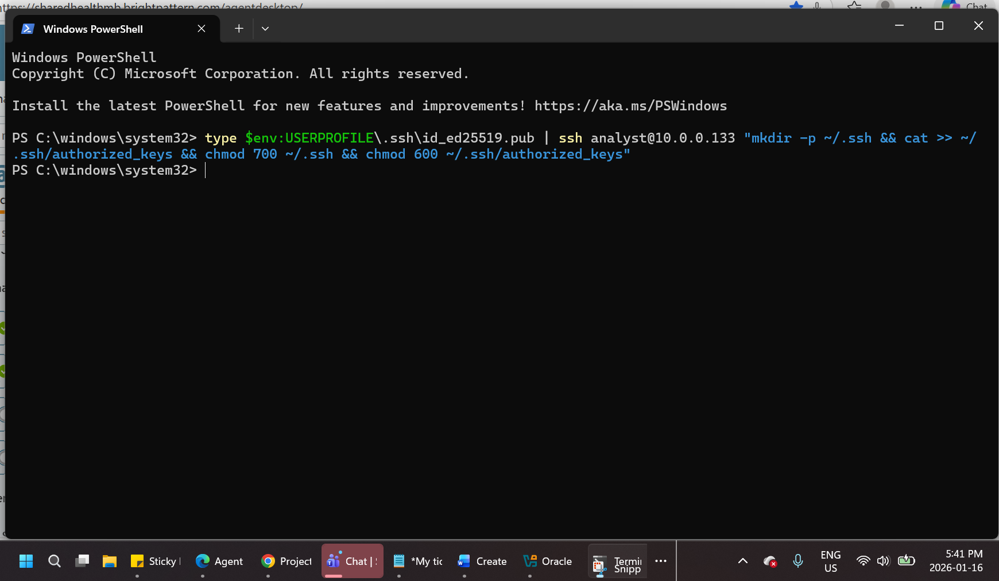

---

### 12. Key-Based SSH Login
Successful SSH login using key-based authentication was verified.

📸 Screenshot:

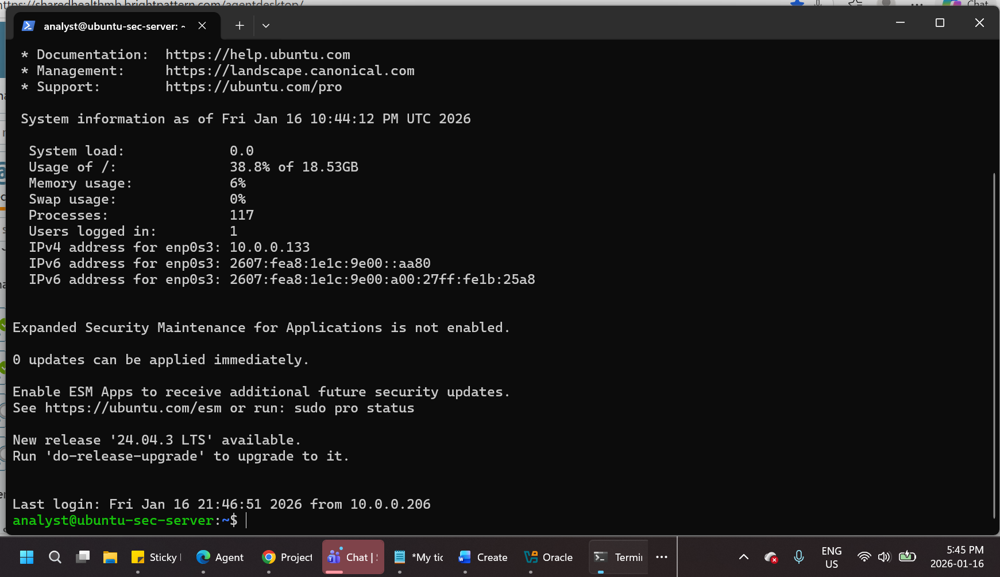

---

### 13. Password Authentication Disabled
Password-based SSH authentication was tested and confirmed to be blocked.

📸 Screenshot:

---

### 14. File & Directory Permission Hardening
Permissions were adjusted to restrict unauthorized access.

📸 Screenshots:

**Before:**

**After:**

---

### 15. Fail2Ban Installation & Status
Fail2Ban was installed, enabled, and verified to protect against brute-force attacks.

📸 Screenshot:

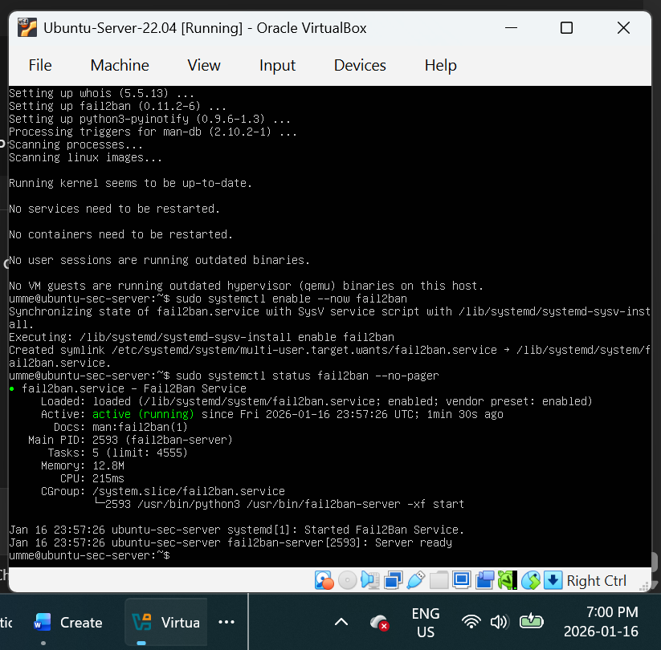

---

### 16. SSH Listening Port Verification
The SSH service was confirmed to be listening on the expected port.

📸 Screenshot:

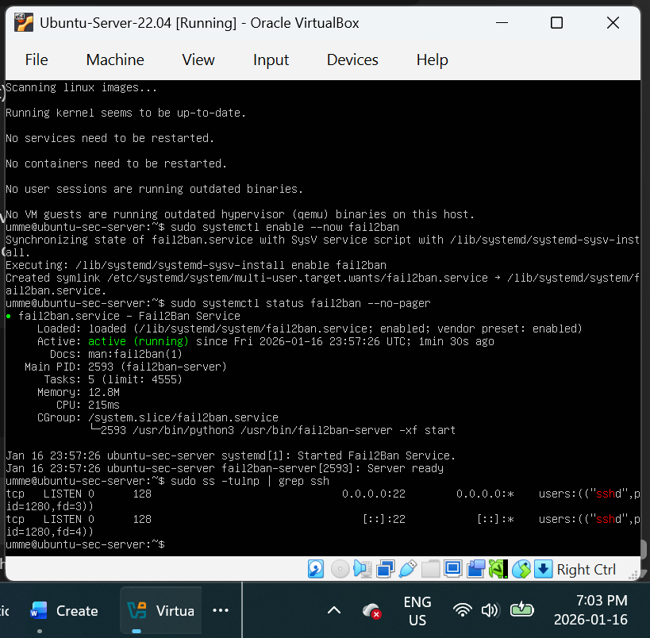

---

## Security Outcomes

- Root login disabled  
- SSH hardened with key-based authentication  
- Firewall enabled with minimal allowed services  
- File permissions restricted appropriately  
- Brute-force attack mitigation enabled  

---

## Data Privacy Note

This assessment was performed in a controlled lab environment.  
No personal, organizational, or production data is included.

---

## Author

**Umme Farva**  
Cybersecurity Analyst
